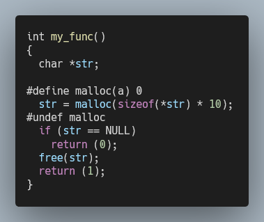

# Null Function C

This project is a small **Vim script** designed to help you improve your code. You can, using a shortcut, add a define to force a function to return NULL (or 0).



## Installation

To install this project, you can clone the repo, and copy the `vim/null_function.vim` file into `~/.vim/plugin` .

But I have a easier solution for you ! Just execute one of these commands:

```shell
mkdir -p ~/.vim/plugin && curl https://raw.githubusercontent.com/valfur03/null-function-c/master/vim/null_function.vim > ~/.vim/plugin/null_function.vim
```

```shell
mkdir -p ~/.vim/plugin && wget https://raw.githubusercontent.com/valfur03/null-function-c/master/vim/null_function.vim -O ~/.vim/plugin/null_function.vim
```

## Usage

You are now ready to go! Try this shortcut `,n` on a line containing a function, and it will **add** a define around it. To **remove** it, type the shortcut again on the same line (doesn't matter if it changed, it just detects the surrounding lines).

If you have **multiple functions** on the same line, put the cursor on the function you want to select.

```c
str = malloc(sizeof(*str) * ft_strlen(src));
      ^                     ^
```

